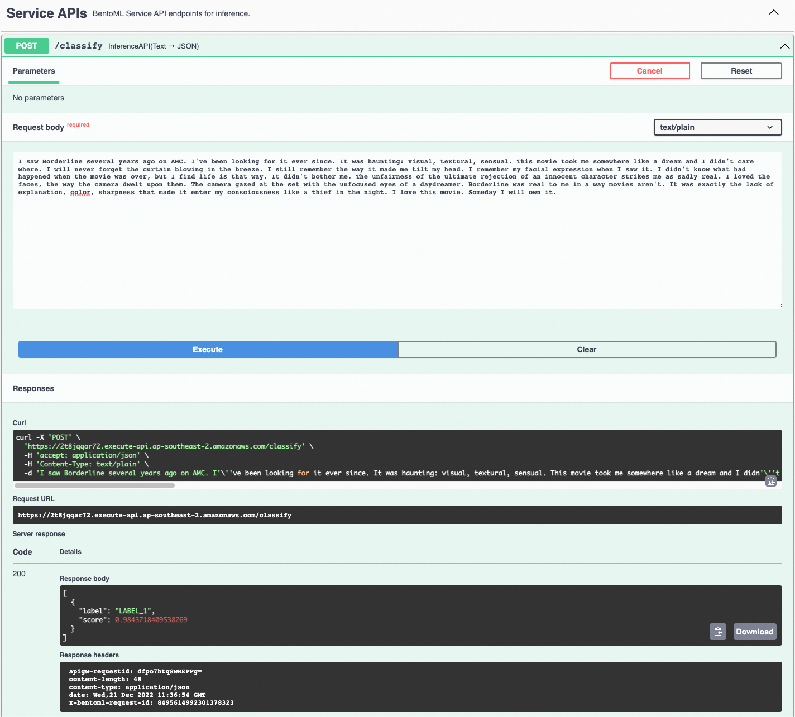
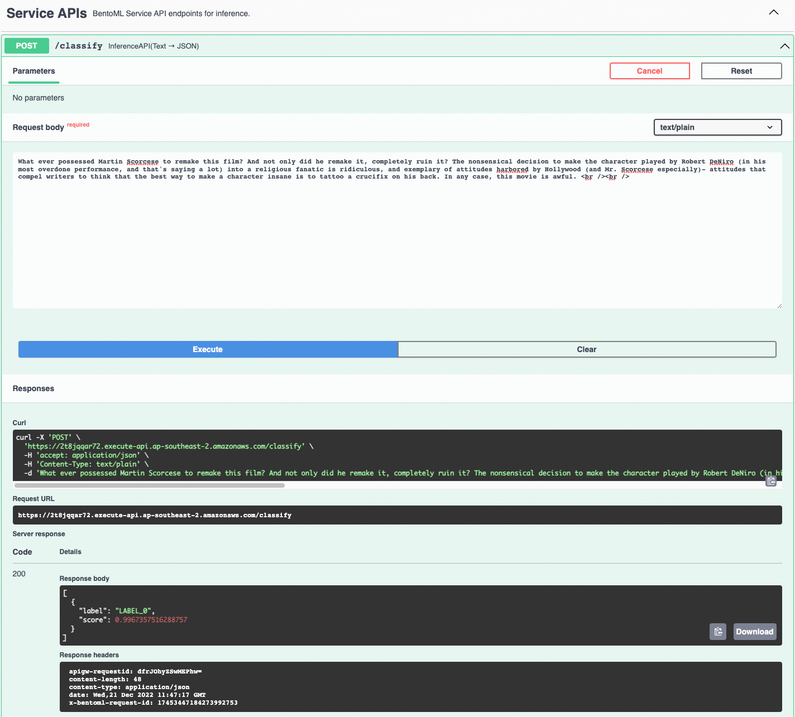

# review-classification-service

This project was inspired by dealing with responses to Net Promoter Score (NPS) surveys. In NPS surveys, customers are asked to give a score between 0-10 indicating how likely they are to recommend the product/service to others, where 0 = extremely unlikely and 10 = extremely likely. They are also asked to provide a comment on why they gave that score. Sometimes, customers give a low score while their comment suggests they were actually happy with the product/service. It would be useful to perform text classification on the comments to understand the true sentiment of the customer.

I tried gradient boosting and transformer models to perform the text classification, and deployed the best model using serverless infrastructure. I didn't have access to an NPS response dataset, so I used an IMDB movie review dataset to train the models to predict whether a review is positive or negative.

### Setup
1. Open a terminal window and `cd` into the project directory.
2. Run `pipenv install` - this will create a virtual environment with the Python packages necessary for model training and deployment.
3. Run `pipenv shell` to enter the virtual environment.

### Training
1. Run `python train.py` to launch the training script and save the trained model.
    - Note: the script trains a Transformer model on a very small subset of the training dataset (50 rows) so that training will complete in a reasonable amount of time on a CPU.
    - The model used in the deployment examples below was trained on a much larger dataset using a GPU

### Deployment

This section assumes you have:
- AWS CLI installed and configured with an AWS account
- Docker Desktop running
- Terraform installed

1. Run `bentoml build` to create a prediction service using trained model.
2. Run `bentoctl operator install aws-lambda` to install the official AWS Lambda operator and its dependencies.
3. Open '/deployment/deployment_config.yaml' and set the `region` value to your AWS account region.
4. Run `bentoctl build -b review-classifier-service:latest -f deployment_config.yaml` - this will build a Lambda-compatible Docker image and push it to an AWS ECR repository
5. Run `terraform init` to initialize the Terraform project.
6. Run `terraform apply -var-file=bentoctl.tfvars -auto-approve` to spin up the infrastucture required to serve the model:
    - Lambda
    - API Gateway
    - IAM roles
    - CloudWatch logs
7. Copy the endpoint from the Terraform output, e.g. endpoint = "https://2t8jqqar72.execute-api.ap-southeast-2.amazonaws.com/" and paste the URL into your browser to test the service.
    - Note: if you get a "service unavailable" error, try refreshing the page.
8. Finally, run `bentoctl destroy -f deployment_config.yaml` to destroy the AWS infrastructure you just created.

The screenshot below illustrates sending a positive review as input to the endpoint, and receiving a classification (LABEL_1 = positive) and probability score:

The screenshot below illustrates sending a negative review as input to the endpoint, and receiving a classification (LABEL_0 = negative) and probability score:
